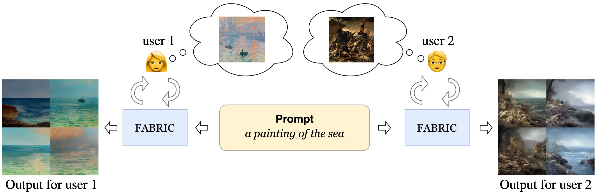

# FABRIC 🎨
## Personalizing Diffusion Models with Iterative Feedback
<div align="center">
<a href="#">Dimitri Von Rütte</a><sup>1</sup>,
<a href="https://elisabettafedele.github.io/">Elisabetta Fedele</a><sup>1</sup>,
<!-- <br /> -->
<a href="#">Jonathan Thomm</a><sup>1</sup>,
<a href="https://lu-wo.github.io/">Lukas Wolf</a><sup>1</sup>

<sup>1</sup>ETH Zürich, Switzerland

<a href="https://pytorch.org/get-started/locally/"></a>
<a href="https://hydra.cc/"></a>



</div>
<br><br>

```
